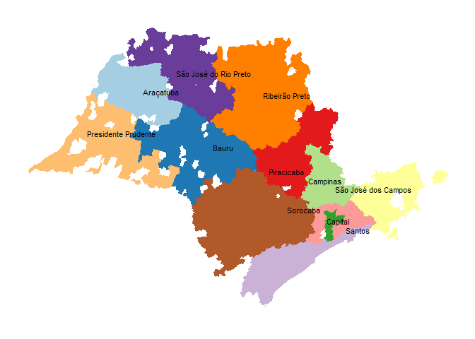
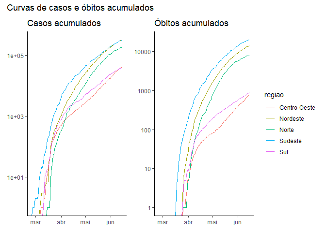
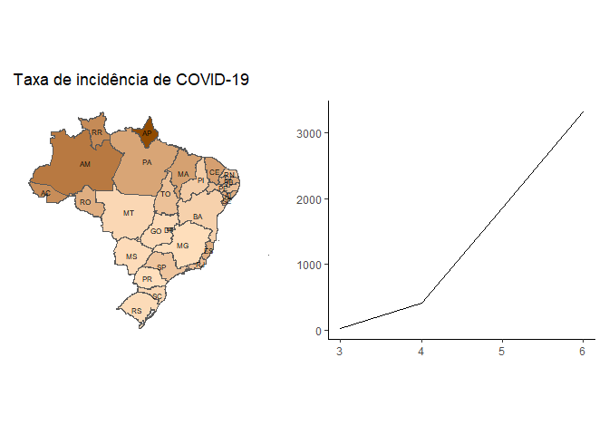
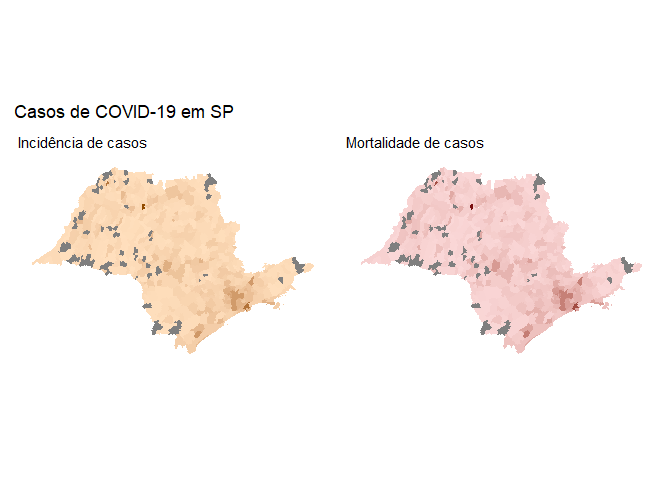
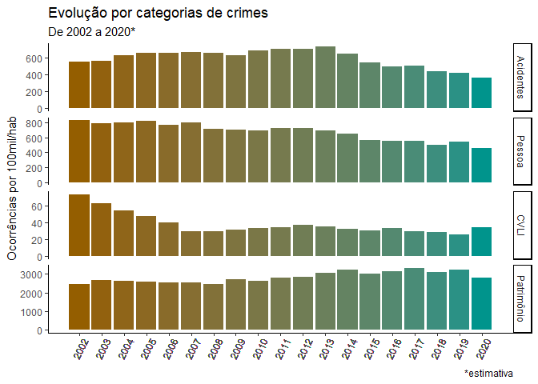
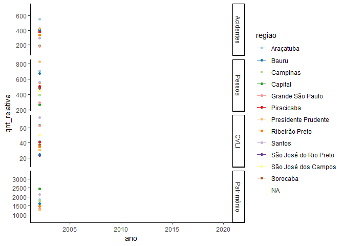
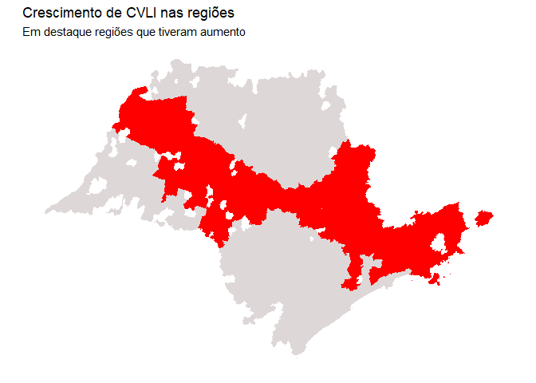

<!-- README.md is generated from README.Rmd. Please edit that file -->

# CRIME E COVID: uma relação doentia? \[1\]

## APRESENTAÇÃO

O presente trabalho visa realizar uma singela análise sobre os índices
de criminalidade no Estado de São Paulo em conjunto com os números da
pandemia causada pela COVID-19.\[2\]

Pretendemos, partindo do contexto da pandemia (um evento novo, que gerou
e ainda gera grande comoção), levantar algumas reflexões sobre os
impactos da violência, que além de velha conhecida no Estado,
aparentemente já foi normalizada em muitos sentidos. Dentre as perguntas
que se pretende instigar (mas sem a pretensão de oferecer respostas):

1.  *Qual é, em linhas gerais, a **tendência de evolução** da incidência
    criminal em SP? Os crimes têm, ao longo das últimas duas décadas
    **diminuído** ou **aumentado**?*

2.  *É possível visualizar **tendências** diferentes nas regiões da
    cidade*?

3.  *Como foi o comportamento dessas tendências **durante os meses em
    que a quarentena** em SP foi mais intensa*? *Houve **padrão** nos
    distintos tipos de crime e nas distintas regiões*?

Ao final, queremos instigar a seguinte provocação na leitora e no
leitor: Será que a violência em São Paulo é também “pandêmica”, isto é,
comparável em magnitude ao que vem ocorrendo com a COVID-19? Será que,
em alguma medida, não vivemos, também, uma ***duradoura*** **e *grave*
pandemia de violência** no Estado? Que “novo normal” poderemos
idealizar, sonhar e construir diante do “velho anormal”?

Para isso, antes de prosseguir, responda mentalmente à seguinte questão:
***temos mais vítimas por COVID-19 ou por crimes violentos***?

## DADOS UTILIZADOS

Para tentar orientar as reflexões propostas, vamos analisar as bases :

  - `COVID`, contendo [dados coletados e tratados pela equipe da
    Curso-R](https://www.youtube.com/watch?v=ja2AbTFN4yk&ab_channel=Curso-R)
    a partir de webscrap do [site do Ministério da
    Saúde](http://covid.saude.gov.br). Os dados estão atualizados até
    15/06/2020, inclusive, e nos trazem informações importantes sobre os
    impactos da pandemia em todo o país.
  - `SSP`, oriundos da mesma Curso-R, com dados extraídos da [Secretaria
    de Segurança Pública de São
    Paulo](http://www.ssp.sp.gov.br/transparenciassp/Consulta.aspx). Os
    dados são de janeiro de 2002 até abril de 2020, a trazem uma rica
    série histórica das principais ocorrências criminais no Estado.

Embora cada uma delas possa render inúmeras análises interessantíssimas,
diante da inquietude das questões apresentadas acima optou-se por olhar
para elas em conjunto.

## METODOLOGIA

Ambas as bases, embora pré-processadas e em formato *tidy*, receberam
tratamento a fim de torná-las comparáveis entre si. O detalhamento dos
passos fica mais evidente nos comentários nos arquivos nas pastas `/R` e
`/data-raw`, porém a seguir trazemos os aspectos mais significativos das
manipulações realizadas.

### *Tratamento dos dados da COVID*

Os dados foram restritos ao estado de **São Paulo** e foram removidas
variáveis como a quantidade de novos casos, casos recuperados, etc, uma
vez que o foco da análise se deu sobre dois indicadores:

  - **Incidência de casos**: ou seja, a quantidade de casos confirmados
    por 100 mil habitantes em um determinado município.

  - **Mortalidade** (ou incidência de mortes): a quantidade de óbitos
    confirmados por 100 mil habitantes naquele mesmo município.

|                                                                                                                               Variáveis originais                                                                                                                                |         Variáveis finais          |
| :------------------------------------------------------------------------------------------------------------------------------------------------------------------------------------------------------------------------------------------------------------------------------: | :-------------------------------: |
| regiao, estado, municipio, coduf, codmun, codRegiaoSaude, nomeRegiaoSaude, data, semanaEpi, populacaoTCU2019, casosAcumulado, casosNovos, obitosAcumulado, obitosNovos, Recuperadosnovos, emAcompanhamentoNovos, eh\_capital, obitosAcumulado\_log2, obitosNovos\_log2, lat, lon | regiao, mes, variavel, quantidade |

*Tab 1. Variáveis da base de dados COVID antes e depois do tratamento*

### *Tratamento dos dados da SSP*

A base originalmente continha variáveis em sub-espécies dos crimes
cometidos, separando por exemplo homicídios de homicídios culposos. Para
melhor aproveitamento dos dados, embora se leve em conta os bens
jurídicos inerentes a cada tipo penal\[3\], conforme se estrutura do
[Código Penal
Brasileiro](http://www.planalto.gov.br/ccivil_03/decreto-lei/del2848compilado.htm),
os crimes foram agrupados por sua natureza e não necessariamente por sua
topologia no código.

As hipóteses originais foram dividas em quatro grupos:

  - **Crimes Violentos Letais Intencionais (CVLI)**: reunindo homicídios
    dolosos, latrocínio (também chamado de roubo seguido de morte) e
    lesão corporal seguida de morte. Para fins desse estudo, se incluiu
    nesse grupo também os homicídios tentados (que, por definição, são
    intencionais), ainda que o óbito não tenha necessariamente ocorrido.
    \[4\]

  - **Crimes contra o patrimônio**: Reunindo roubos (exceto se
    resultantes em óbito) e furtos (de qualquer tipo).

  - **Outros crimes contra a pessoa**: Reunindo estupros\[5\] (em todas
    as modalidades) e lesões corporais. Sabe-se que ambos possuem grande
    diferença quanto aos contextos criminológicos em que ocorrem, porém
    apenas e exclusivamente para fins metodológicos fez sentido
    agrupá-los aquo.

  - **Acidentes penalmente relevantes:** Agrupou-se os crimes de
    trânsito (inclusive as modalidades dolosas), lesões corporais
    culposas e homicídios culposos. Da mesma forma que no caso anterior,
    a proposta é unicamente didática, tendo em mente que todos os crimes
    aqui descritos possuem um aspecto subjetivamente não-intencional,
    mesmo nos casos de dolo eventual.

|                                                                                                                                                                                                                                                               Variáveis originais                                                                                                                                                                                                                                                                |                  Variáveis finais                   |
| :----------------------------------------------------------------------------------------------------------------------------------------------------------------------------------------------------------------------------------------------------------------------------------------------------------------------------------------------------------------------------------------------------------------------------------------------------------------------------------------------------------------------------------------------: | :-------------------------------------------------: |
| mes, ano, delegacia\_nome, municipio\_nome, regiao\_nome, estupro, estupro\_total, estupro\_vulneravel, furto\_outros, furto\_veiculos, hom\_culposo\_acidente\_transito, hom\_culposo\_outros, hom\_doloso, hom\_doloso\_acidente\_transito, hom\_tentativa, latrocinio, lesao\_corp\_culposa\_acidente\_transito, lesao\_corp\_culposa\_outras, lesao\_corp\_dolosa, lesao\_corp\_seg\_morte, roubo\_banco, roubo\_carga, roubo\_outros, roubo\_total, roubo\_veiculo, vit\_hom\_doloso, vit\_hom\_doloso\_acidente\_transito, vit\_latrocinio | ano, regiao, tipo\_crime, quantidade, qnt\_relativa |

*Tab 2. Variáveis da base SSP antes e após tratamento*

### Convergência dos dados

A fim de que se pudesse tornar os dados estudados comparáveis em algumas
medidas, adotou-se os seguintes padrões:

  - Os dados de **população**, oriundos das projeções do Tribunal de
    Contas da União (TCU) para 2019, foram aproveitados para ambas as
    bases. Elas vieram originalmente na base `COVID` e foi daptada para
    a base `SSP`.

  - Como as bases possuiam recortes temporais distintos, os dados de
    segurança da `SSP`foram *projetados até o final do an*o,
    considerando as tendências até abril/2020. Ou seja, levando-se em
    conta os dados do primeiro quadrimestre de 2020, procurou projetar
    os números até o fim do ano.

  - As **regiões** da Segurança Pública (base `SSP`) foram aproveitadas
    também para os dados da pandemia (base `COVID`). Assim, os dados
    foram apresentados considerando as mesmas 12 regiões, recebendo na
    maioria dos casos os nomes de uma das cidades que a representam.
    Abaixo a visualização geo-espacial de cada uma delas:

<!-- -->

## ESTADO DE SÃO PAULO E A COVID-19

Como é sabido, o Brasil chegou rapidamente aos países com mais casos no
mundo, mesmo havendo reconhecida subnotificação e negacionismo por parte
de autoridades públicas. Não iremos adentrar nas razões (e nas omissões)
que nos trouxeram até aqui, porém é importante ressaltar que a gravidade
da pandemia em nosso país é sem precedentes recentes.

Vejamos:

<!-- --><!-- --><!-- -->

### Incidência de casos e Mortalidade em SP

Por outro lado, o Estado de São Paulo foi por muito tempo o “epicentro”
da pandemia no país, na medida em que - se imagina - que foram onde se
originaram os primeiros casos, irradiando o contágio comunitário para
outros cantos do país.

Oportuno, portanto, olhar um pouco dos indicadores da COVID-19 no
Estado:

|        Região         | Tx. Incidência | Tx. Mortalidade |
| :-------------------: | :------------: | :-------------: |
|       Araçatuba       |      99,8      |       5,8       |
|         Bauru         |     138,6      |       4,5       |
|       Campinas        |     234,4      |      10,7       |
|        Capital        |     762,7      |      46,1       |
|   Grande São Paulo    |     424,2      |      32,3       |
|      Piracicaba       |     134,6      |       5,9       |
|  Presidente Prudente  |      85,1      |       5,0       |
|    Ribeirão Preto     |     135,9      |       4,5       |
|        Santos         |     632,1      |      27,8       |
| São José do Rio Preto |     178,2      |       6,1       |
|  São José dos Campos  |     150,1      |       5,2       |
|       Sorocaba        |     148,8      |       7,0       |

<!-- -->

Fica claro que, a despeito das diferenças regionais de intensidade, a
pandemia teve (e ainda tem) grande impacto em todo o território.

## O CRIME E O ESTADO DE SÃO PAULO

### Tendências

Vamos observar a evolução de ocorrências criminais registradas de 2002
até 2020.

<!-- -->

É bastante evidente que há uma constante queda geral no número de
ocorrências nos últimos anos, sobretudo a partir da segunda metade da
década passada. Existem diversos fatores, por certo, que explicam essa
queda, todos eles fora de nossos objetivos aqui.

No que pese a explicação das razões que levam a essa queda estejam fora
de nosso objetivo, faz sentido aqui olhar para cada uma das quatro
categorias individualmente, afim de verificar se esses números se
refletiram em todas elas.

### Criminalidade durante a pandemia

Por outro lado, a despeito de existir uma tendência de redução do
cômputo de casos em números gerais, ao olhar para o comportamento das
diversas categorias podemos perceber diferenças entre elas:

<!-- -->

O gráfico pode ser complementado pela tabela abaixo, focada nos últimos
5 anos:

|     Crime      |  2015   |  2016   |  2017   |  2018   |  2019   |  2020   |
| :------------: | :-----: | :-----: | :-----: | :-----: | :-----: | :-----: |
|      CVLI      |  19,3   |  17,9   |  16,9   |  15,3   |  14,4   |  14,5   |
|   patrimonio   | 1.996,0 | 2.075,9 | 2.145,6 | 1.983,0 | 1.946,6 | 1.634,6 |
| contra\_pessoa |  325,3  |  327,6  |  323,4  |  306,1  |  312,5  |  262,5  |
|   acidentes    |  264,6  |  231,5  |  212,0  |  182,8  |  179,8  |  134,2  |

## Perguntas importantes (e sem respostas)

A queda generalizada nos registros criminais chama parece fazer sentido
se considerada a tendência geral e já há alguns anos. Porém, o fato de
não haver a mesma redução e - pior - um ligeiro aumento nos CVLI traz
questões importantes.

#### Houve redução real nas ocorrências ou, meramente, aumento na subnotificação de crimes?

Por um lado, o fato de haver menor número de pessoas circulando parece
justificar uma menor incidência de crimes contra o patrimônio, acidentes
e crimes contra a pessoa. Por outro lado, os CVLI têm como peculiaridade
a baixa taxa de subnotificação por natureza - afinal, a morte de uma
pessoa dificilmente passa sem ser notada. Mas o que explicaria o
aumento?

Além disso, é preciso notar que parte importante dos equipamentos
públicos - delegacias de polícia inclusas - fecharam as portas total ou
parcialmente durante os meses iniciais da pandemia. Isso pode ter levado
a um desencorajamento do reporte de crimes, ainda que parte relevante
deles seja passível de notificação mediante Boletim de Ocorrência
eletrônico.

Ainda, se essa hipótese - a mera subnotificação - se mostrar verdadeira,
um alarme deveria soar perante as autoridades públicas: é plausível
imaginar que mais crimes de estupro e, pior, estupro de vulnerável,
tenham aumentado ainda mais durante o período de isolamento. Sabe-se, há
tempos, que [parte relevante desses casos ocorre em ambientes
domésticos](http://g1.globo.com/bom-dia-brasil/noticia/2014/08/quase-70-dos-estupros-acontecem-em-ambientes-domesticos-diz-policia.html).

#### Mortes decorrentes de intervenção policial?

Um fato digno de nota que coincidiu com os primeiros meses da pandemia
foi a comoção em torno da morte do afroamericano **George Floyd**, que
deu início a manifestações em diversos pontos do mundo. No Brasil, o
movimento negro há anos denuncia os grandes números de casos de mortes
causadas pela polícia, em contextos das chamadas “intervenções
policiais”.

Foge do escopo desse estudo nos aprofundarmos nesse tema. Inclusive, o
banco SSP não continha os dados para essas ocorrências e,
consequentemente, ela não foi computada. O que ocorre, por outro lado, é
que [estudos apontam o crescimento desses números durante o ano
de 2020](https://www1.folha.uol.com.br/cotidiano/2020/07/letalidade-policial-bate-recorde-e-homicidios-durante-a-pandemia-em-sp.shtml),
independnetemente de haver correlação (e não causalidade) com a
pandemia.

#### Todas as regiões tiveram comportamento semelhante?

Vamos observar como se deu a distribuição dos crimes pelas regiões
adotadas nesse estudo.

<!-- -->

Para melhor visualizar quais foram as regiões que tiveram aumento,
reforçando o que o gráfico nos mostra, vejamos a tabela a seguir:

<table class=" lightable-paper lightable-striped" style="font-family: &quot;Arial Narrow&quot;, arial, helvetica, sans-serif; width: auto !important; margin-left: auto; margin-right: auto;">

<thead>

<tr>

<th style="text-align:center;">

Região

</th>

<th style="text-align:center;">

População

</th>

<th style="text-align:center;">

2019

</th>

<th style="text-align:center;">

2020

</th>

<th style="text-align:center;">

Diferença em %

</th>

</tr>

</thead>

<tbody>

<tr>

<td style="text-align:center;">

Araçatuba

</td>

<td style="text-align:center;">

784.310

</td>

<td style="text-align:center;">

22,3

</td>

<td style="text-align:center;">

34,2

</td>

<td style="text-align:center;">

53,5

</td>

</tr>

<tr>

<td style="text-align:center;">

Bauru

</td>

<td style="text-align:center;">

1.867.184

</td>

<td style="text-align:center;">

14,4

</td>

<td style="text-align:center;">

17,8

</td>

<td style="text-align:center;">

23,7

</td>

</tr>

<tr>

<td style="text-align:center;">

Campinas

</td>

<td style="text-align:center;">

3.809.471

</td>

<td style="text-align:center;">

14,7

</td>

<td style="text-align:center;">

14,8

</td>

<td style="text-align:center;">

0,5

</td>

</tr>

<tr>

<td style="text-align:center;">

Capital

</td>

<td style="text-align:center;">

12.252.023

</td>

<td style="text-align:center;">

12,4

</td>

<td style="text-align:center;">

11,4

</td>

<td style="text-align:center;">

\-7,8

</td>

</tr>

<tr>

<td style="text-align:center;">

Grande São Paulo

</td>

<td style="text-align:center;">

9.413.274

</td>

<td style="text-align:center;">

13,0

</td>

<td style="text-align:center;">

13,7

</td>

<td style="text-align:center;">

4,8

</td>

</tr>

<tr>

<td style="text-align:center;">

Piracicaba

</td>

<td style="text-align:center;">

3.314.154

</td>

<td style="text-align:center;">

13,2

</td>

<td style="text-align:center;">

14,7

</td>

<td style="text-align:center;">

12,1

</td>

</tr>

<tr>

<td style="text-align:center;">

Presidente Prudente

</td>

<td style="text-align:center;">

1.079.896

</td>

<td style="text-align:center;">

11,4

</td>

<td style="text-align:center;">

10,8

</td>

<td style="text-align:center;">

\-4,8

</td>

</tr>

<tr>

<td style="text-align:center;">

Ribeirão Preto

</td>

<td style="text-align:center;">

3.666.016

</td>

<td style="text-align:center;">

14,2

</td>

<td style="text-align:center;">

12,8

</td>

<td style="text-align:center;">

\-10,1

</td>

</tr>

<tr>

<td style="text-align:center;">

Santos

</td>

<td style="text-align:center;">

2.145.688

</td>

<td style="text-align:center;">

19,9

</td>

<td style="text-align:center;">

16,6

</td>

<td style="text-align:center;">

\-16,5

</td>

</tr>

<tr>

<td style="text-align:center;">

São José do Rio Preto

</td>

<td style="text-align:center;">

1.552.180

</td>

<td style="text-align:center;">

15,3

</td>

<td style="text-align:center;">

11,6

</td>

<td style="text-align:center;">

\-24,4

</td>

</tr>

<tr>

<td style="text-align:center;">

São José dos Campos

</td>

<td style="text-align:center;">

2.515.574

</td>

<td style="text-align:center;">

25,7

</td>

<td style="text-align:center;">

29,1

</td>

<td style="text-align:center;">

13,1

</td>

</tr>

<tr>

<td style="text-align:center;">

Sorocaba

</td>

<td style="text-align:center;">

3.119.491

</td>

<td style="text-align:center;">

13,7

</td>

<td style="text-align:center;">

12,7

</td>

<td style="text-align:center;">

\-7,2

</td>

</tr>

</tbody>

</table>

Geograficamente, podemos destacar as regiões que tiveram esse aumento:

<!-- -->

Vemos, portanto, que, embora existam ainda perguntas sem resposta, está
claro que os crimes violentos letais intencionais (CVLI) tiveram um
destaque importante durante a pandemia: tanto por vermos,
surpreendentemente, revertida a tendência histórica de redução, como,
também, pelas questões postas acima.

Oportuno, então, observar com mais vagar essa categoria de crimes.

## Violência pandêmica?

Convidamos o leitor e a leitora a retomarem a pergunta feita no início:
temos mais vítimas por COVID-19 ou por crimes violentos?

Essa questão é importante pois, é inegável que há relevantes impactos
sociais, econômicos e culturais que a COVID-19 irá impor ao Brasil e a o
mundo.

Se a resposta da pergunta acima, à luz dos dados postos, indicar que
nesse mesmo período a violência ceifou mais vidas do que o coronavírus,
poderíamos nos perguntar se a violência no Estado não se tornou, também
ela, pandêmica.

Para continuar essa reflexão vamos olhar para as cidades que tiveram ao
menos um registro de óbito por COVID. Elas totalizam 286 cidades.

Dessas, vamos verificar se e quais cidades tiveram mais óbitos por COVID
do que por CVLI. Embora imperfeita, a comparação é possível considerando
que o resultado dos CVLI é o óbito\[6\].

<table class=" lightable-paper lightable-hover" style="font-family: &quot;Arial Narrow&quot;, arial, helvetica, sans-serif; width: auto !important; margin-left: auto; margin-right: auto;">

<thead>

<tr>

<th style="text-align:center;">

municipio

</th>

<th style="text-align:center;">

populacao

</th>

<th style="text-align:center;">

CVLI

</th>

<th style="text-align:center;">

obito\_covid

</th>

<th style="text-align:center;">

causa\_maior

</th>

</tr>

</thead>

<tbody>

<tr>

<td style="text-align:center;">

São Paulo

</td>

<td style="text-align:center;">

12.252.023

</td>

<td style="text-align:center;">

4,0

</td>

<td style="text-align:center;">

34,9

</td>

<td style="text-align:center;">

covid

</td>

</tr>

<tr>

<td style="text-align:center;">

Santos

</td>

<td style="text-align:center;">

433.311

</td>

<td style="text-align:center;">

28,8

</td>

<td style="text-align:center;">

34,2

</td>

<td style="text-align:center;">

covid

</td>

</tr>

<tr>

<td style="text-align:center;">

Embu-Guaçu

</td>

<td style="text-align:center;">

69.385

</td>

<td style="text-align:center;">

0,0

</td>

<td style="text-align:center;">

14,4

</td>

<td style="text-align:center;">

covid

</td>

</tr>

<tr>

<td style="text-align:center;">

São Luiz do Paraitinga

</td>

<td style="text-align:center;">

10.687

</td>

<td style="text-align:center;">

0,0

</td>

<td style="text-align:center;">

9,4

</td>

<td style="text-align:center;">

covid

</td>

</tr>

<tr>

<td style="text-align:center;">

Uchoa

</td>

<td style="text-align:center;">

10.110

</td>

<td style="text-align:center;">

0,0

</td>

<td style="text-align:center;">

9,9

</td>

<td style="text-align:center;">

covid

</td>

</tr>

<tr>

<td style="text-align:center;">

Tarabai

</td>

<td style="text-align:center;">

7.468

</td>

<td style="text-align:center;">

0,0

</td>

<td style="text-align:center;">

13,4

</td>

<td style="text-align:center;">

covid

</td>

</tr>

</tbody>

</table>

De um lado, chama atenção que a COVID tenha sido a maior causa de óbito
em apenas 6 municípios, sendo que 4 deles não tiveram nenhuma morte
registrada por CVLI.

Por outro lado, chama atenção que as duas cidades que tiveram mais
mortes por COVID do que por CVLI sejam, justamente São Paulo - a capital
e maior cidade do país - e Santos, uma das principais cidades do
litoral.

## Conclusão?

Tendo em mente tudo o que observamos aqui, pudemos constatar que:

  - A COVID-19 teve (e, quiçá, ainda tem) enorme impacto em todo o
    estado de São Paulo;

  - Não se pode afirmar, necessariamente, relação de causa e efeito
    entre a pandemia e a criminalidade. Porém, o número de ocorrências
    sofreu queda neste período, com destacada exceção - justamente - dos
    CVLI.

  - Há fatores como a subnotificação que podem melhor explicar esse
    fenômeno. Por outro lado, continua sendo intrigante o não-impacto
    sobre esses crimes violentos.

  - Que “novo normal” pretendemos construir ao fim da pandemia de
    COVID-19? Ele inclui o enfrentamento das causas que levam a taxas de
    violência tão significativas?

## Próximos temas

Menos pelo que foi dito e mais pelo que não pode ser dito, é possível
levantar algumas questões para estudos futuros e mais aprofundados:

  - Considerando que em CVLI não são englobadas as mortes causadas por
    intervenção policial, é importante considerar esse aspecto.

  - Observar dados mais atualizados tanto de crimes quanto de COVID pois
    é possível que a taxa constante de crimes não tenha sido superada
    pelas da pandemia.

  - Levar em conta que é possível que haja registro tardio de crimes
    ocorridos nesse período e represados (ou subnotificados) durante a
    pandemia.

  - Observar em outros países as taxas de criminalidade a fim de
    verificar possíveis padrões.

## Notas

1.  A ideia do nome veio de uma excelente matéria da [Revista
    piauí](https://piaui.folha.uol.com.br/crime-e-covid-no-rio/)

2.  Ele se dá no contexto de conclusão do [Curso de R para Ciência de
    Dados](https://www.curso-r.com/cursos/r4ds-2/) e, portanto, não tem
    grandes pretensões científicas. Ainda, é preciso levar em conta a
    inexperiência do autor com programação em R e com análise de dados
    de modo geral.

3.  De acordo com as teorias clássicas do Direito Penal. Grosso modo,
    poderia se dizer que o bem juridico penal é aquele valor protegido
    pelo direito penal em cada um dos crimes. Essa ideia permeia todo o
    Código Penal. Por exemplo, o homicídio (Art. 121) se encontra no
    título I, “*Dos Crimes contra a pessoa*”, e, neste, no Capítulo I,
    “*Dos crimes contra a vida*”.

4.  A classificação em CVLI é seguida pela SENASP-MJ e dá mais ênfase ao
    resultado (vulneração da vida) do que na conceituação jurídica dos
    atos (na prática, isso permite tratar de forma semelhante, p. ex., o
    homicídio e o roubo seguido de morte, que, a rigor, é considerado um
    crime contra o patrimônio).

5.  A rigor, o crime de estupro está previsto no artigo 217 do Código
    Penal, em título que hoje se chama “Crime contra a dignidade
    sexual”. É preciso levar em conta, porém, que originalmente essa
    parte do cógido era denominada “Crimes contra os costumes”, o que
    representa uma visão antiquada - e inadequada - do tema. Entende-se
    aqui que sua natureza se aproxima muito mais de crimes contra a
    integridade física e emocional, de modo que poderia perfeitamente
    ocupar o mesmo capítulo do código inerente aos crimes contra a
    pessoa.

6.  Ainda que aqui tenhamos agrupado também os homicídios não consumados
    (“tentativas de homicídio”).
